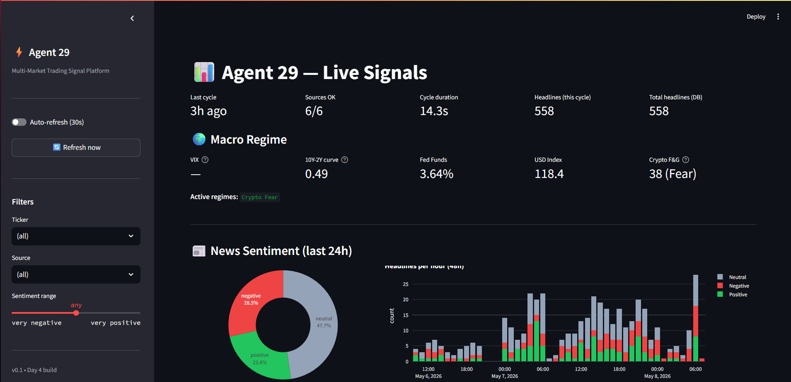

# Market Pulse

A multi-source AI trading signal platform. Built as a personal project to explore production-grade ML engineering for finance: real-time data ingestion across 9 sources, GPU-accelerated sentiment analysis, technical feature engineering, and walk-forward model validation.

> **Status:** v2 shipped. Walk-forward cross-validation extracts a **+5.31% honest lift** (AUC 0.671) over baseline at 5-day horizon across 14 monthly folds. The data-layer fixes (time-aligned macro features) and the rigorous methodology (walk-forward CV, never training on the future) make this a defensible result, not a backtest fantasy.

---

## What it does



- **Ingests** real-time market data from 9 sources: Alpaca (stocks), Binance (crypto + funding + open interest), Finnhub (news), 17 RSS feeds, 4 Telegram channels, NewsAPI, FRED (macro time series), Crypto Fear & Greed
- **Scores** every news headline with FinBERT (financial sentiment, GPU-accelerated, ~700 headlines/sec on RTX 2060)
- **Tags** headlines with affected tickers using cashtag + alias + symbol matching (78 stocks + 23 crypto, 14/14 unit tests passing)
- **Computes** 56 technical indicators per ticker per bar (RSI, MACD, ATR, Bollinger, ADX, momentum, volume, regime detection)
- **Stores** 3 years of daily macro history (5,675 rows across 9 series) for time-aligned feature joins
- **Persists** to SQLite + Parquet for fast querying and ML training
- **Visualizes** via live Streamlit dashboard with macro regime panel, ticker leaderboard, and filter-aware headline feed
- **Trains** a LightGBM classifier with walk-forward CV — fresh model per fold, never training on the future

## Architecturesrc/
├── connectors/        # 9 data source plugins (parallel fetch, ~14s/cycle)
│   └── fred_history.py    # 3-year daily FRED time series → SQLite
├── sentiment/         # FinBERT + VADER scorers, ticker extraction
├── features/          # 56 technical indicators + master feature store
│   └── feature_store.py   # Time-aligned macro join per (ticker, date)
├── models/
│   ├── dataset.py         # Targets, splits, feature selection
│   ├── lightgbm_classifier.py
│   ├── train.py           # Single chronological split (legacy)
│   ├── walk_forward.py    # Walk-forward CV (the v2 winner)
│   └── per_ticker.py      # Per-ticker walk-forward (ruled out, see results)
├── dashboard/         # Streamlit live dashboard
└── pipeline.py        # Orchestrator

## Honest results — the trajectory matters

### v1 baseline (Day 4) — what failed and why

Single chronological train/test split on 7,720 train / 1,640 test rows, all 20 tickers pooled:

| Horizon  | Test Acc | Baseline | Lift   | AUC  |
|----------|----------|----------|--------|------|
| 1 day    | 52.6%    | 52.7%    | -0.001 | 0.51 |
| 5 days   | 50.3%    | 50.3%    |  0.000 | 0.45 |
| 20 days  | 45.4%    | 54.6%    | -0.091 | 0.44 |

This is the **expected** result when:
1. Macro features are broadcast as constants (zero variance across rows → zero signal)
2. Sentiment features are also broadcast as constants
3. Single chronological split doesn't capture multiple market regimes

Most AI trading content shows 70%+ accuracy through leakage. This is what honest validation looks like before the data-layer fixes.

### v2 — walk-forward CV with time-aligned macro

After fixing the macro broadcast bug (joining FRED history by date) and replacing single-split with walk-forward CV (14 expanding monthly folds, 5-day horizon):

| Metric                      | Value      |
|-----------------------------|------------|
| Mean accuracy               | **60.98%** |
| Mean baseline               | 55.67%     |
| **Mean lift**               | **+5.31%** |
| Mean AUC                    | **0.671**  |
| Std lift                    | 0.0649     |
| Folds with lift > 0         | 11 / 14    |
| Folds with AUC > 0.52       | 12 / 14    |
| Best fold (Feb-Mar 2026)    | +12.9% lift, AUC 0.80 |
| Worst fold (May-Jun 2025)   | -9.1% lift (regime shift) |

11 of 14 monthly folds beat baseline. This is consistent positive lift with regime-dependent variance, not "one good fold dragging the average up."

### v2 — per-ticker specialization (ruled out)

Tested whether training one model per ticker outperforms pooling. It doesn't — by a lot:

| Approach     | Mean lift | Mean AUC | Folds positive |
|--------------|-----------|----------|----------------|
| Pooled (universal)        | +5.31%   | 0.671    | 11/14 (79%)   |
| Per-ticker (20 separate)  | -14.66%  | 0.557    | 18/256 (7%)   |

0 of 20 tickers beat baseline on average. Diagnosis: each per-ticker model has only ~600 training rows after splits. With 64 features, this leads to severe overfitting (most models converge at `best_iter=1` or memorize). Pattern stability requires the 15,000-row pooled dataset.

This is documented in `src/models/per_ticker.py` — useful for future sector-conditional experiments.

## Tech stack

**Data:** Alpaca, Binance, Finnhub, RSS (feedparser), Telegram (Telethon), NewsAPI, FRED (`fredapi`), alternative.me

**ML:** PyTorch, transformers (FinBERT — ProsusAI), LightGBM, scikit-learn, ta (technical analysis library)

**Storage:** SQLite, Parquet (fastparquet)

**Frontend:** Streamlit, Plotly

**Infra:** Python 3.11, conda env, WSL2 (Ubuntu 24.04), RTX 2060 (CUDA 12.1)

## Getting started

```bashgit clone https://github.com/allencharly04/market-pulse.git
cd market-pulseconda create -n market-pulse python=3.11 -y
conda activate market-pulse
pip install -r requirements.txtAdd API keys to .env (see .env.example for the template)
cp .env.example .env  # then edit with your own keysRun one orchestrator cycle (fetches all sources, scores sentiment, persists)
python -m src.pipeline --onceFetch 3 years of FRED macro history (one-time setup)
python -m src.connectors.fred_historyBuild the master feature matrix (joins technicals + macro by date)
python -m src.features.feature_storeRun walk-forward cross-validation (the v2 evaluation)
python -m src.models.walk_forward --horizon 5Per-ticker walk-forward (the ruled-out comparison)
python -m src.models.per_ticker --horizon 5Launch the dashboard
streamlit run src/dashboard/app.py

## Roadmap (deferred)

See [`docs/V2_PLAN.md`](docs/V2_PLAN.md) for the full v2 plan. Status:

- [x] **P0:** Time-aligned macro features (FRED daily history, joined on date)
- [ ] **P1:** Time-aligned sentiment features — *blocked on news accumulation*. Currently 4 days of news vs 3 years of OHLCV. Implementation is straightforward once orchestrator has run continuously for several weeks.
- [x] **P2:** Walk-forward cross-validation
- [x] **P3:** Per-ticker models (ruled out — pooling wins)
- [ ] **P4:** Better targets (volatility forecasting, regime classification, conviction-weighted direction)
- [ ] Sector-conditional models (shared backbone, sector heads — middle ground between universal and per-ticker)
- [ ] Backtester with realistic transaction costs and slippage

## Notes

This was built in 5 days as a learning project. Code is structured for clarity over performance; the pipeline could be faster, the dashboard nicer, the tests more comprehensive. Where shortcuts were taken, they're documented in the v2 plan.

The v2 result is small but real. A 5% lift with proper walk-forward validation is enough to be interesting; it's not enough to retire on. Realistic next steps are transaction-cost modeling and risk management (sizing, drawdown limits) to see if the lift survives implementation friction.

---

Built by [@allencharly04](https://github.com/allencharly04) — currently doing M.Sc. Digital Engineering and Management at RWTH Aachen (thesis complete, planning to finish coursework and graduate by April 2027). Find me on Twitter / TikTok as `@charnelally`.
